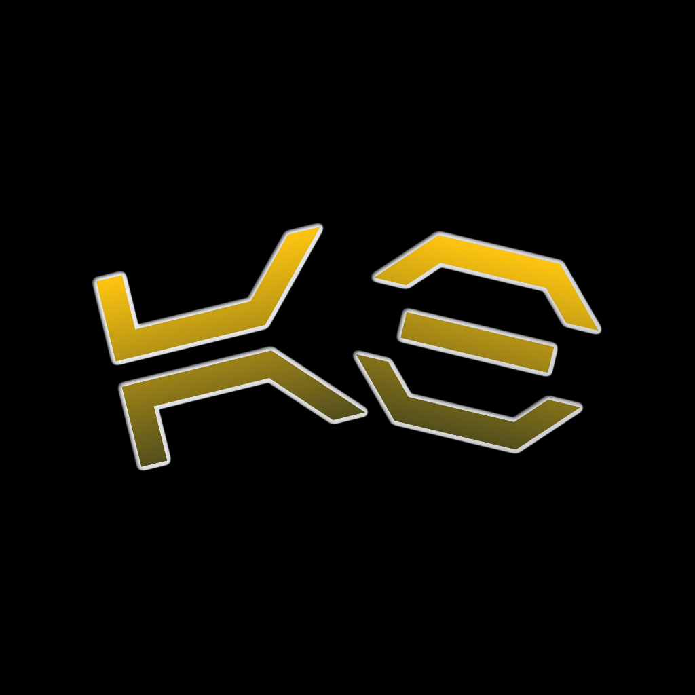

# Aurebesh Translator | Swift Student Challenge 2026

This repository contains my Swift Student Challenge 2026 submission: **Aurebesh Translator**, an iOS Swift Playground app inspired by and based on my App Store app, [**Datapad | Aurebesh Translator**](https://apps.apple.com/us/app/datapad-aurebesh-translator/id6450498054?platform=iphone). It is designed to help users explore galactic writing systems in a fun, immersive, and beginner-friendly way through translation, customization, and interactive learning.

This project showcases my passion for building educational and creative tools that make language and design feel exciting and approachable. Using Swift Playground, the app creates a polished sci-fi experience centered around Aurebesh while staying aligned with Apple's vision of creativity, innovation, and expressive app design.

Created by **Abubakr Elmallah.** Submitted in **2026**.

## Features

- **Powerful Galactic Translator**:  
  Instantly convert text between English and galactic scripts with a smooth, immersive interface.

- **Aurebesh-Focused Script Support**:  
  Explore multiple Aurebesh styles and related galactic writing systems, including Mando'a and Outer Rim inspired scripts.

- **Digraph Rendering**:  
  Accurately displays letter combinations like "ch," "ae," "sh," and "th" for more faithful translations.

- **Alphabet Viewer and Learning Tools**:  
  Learn each script's symbols, names, and mappings through an interactive interface designed for discovery.

- **Customization and Immersion**:  
  Personalize the experience with themed visuals, script immersion options, font choices, and interface styling.

- **Archives and Sharing**:  
  Save past translations and share them as stylized visuals across platforms.

- **Offline and Private Experience**:  
  Works fully offline with no ads, no tracking, and no subscriptions.

## Credits

- App inspiration and source concept from [**Datapad | Aurebesh Translator**](https://apps.apple.com/us/app/datapad-aurebesh-translator/id6450498054?platform=iphone)
- Created and designed by **Abubakr Elmallah**

## License

This project is licensed under the MIT License. Feel free to use, modify, and distribute the code, but please provide attribution.

## Feedback

I would love to hear your thoughts and suggestions! Feel free to open an issue or contact me.

## Contact

For feedback, feature requests, or questions, feel free to reach out:
- **Email**: ammelmallah@icloud.com
- **Website**: [abubakrelmallah.com](https://abubakrelmallah.com/)
- **LinkedIn**: [linkedin.com/abubakr](https://www.linkedin.com/in/abubakr-elmallah-416a0b273/)

Created by Abubakr Elmallah